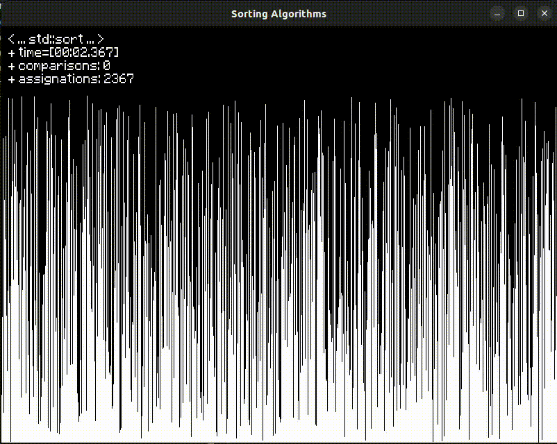

# Sorting-Algorithms

Welcome to Sorting Algorithms! This program showcases various sorting algorithms implemented using SFML.

## About
This program is designed to visualize and compare different sorting algorithms in action. It utilizes the SFML library to create interactive visualizations of sorting algorithms. 

## Features
- **Shuffle Mode**: Allows you to shuffle the array of elements for a fresh sorting demonstration.
- **Insertion Sort**: A simple sorting algorithm that builds the final sorted array one element at a time.
- **Selection Sort**: Sorts an array by repeatedly finding the minimum element from the unsorted part and putting it at the beginning.
- **Bubble Sort**: Repeatedly steps through the list, compares adjacent elements, and swaps them if they are in the wrong order.
- **std::sort**: The C++ standard library sorting algorithm, which is typically a highly efficient implementation of quicksort.
- **Merge Sort**: Divides the array into two halves, sorts each half, and then merges them into a single sorted array.
- **Quick Sort**: Divides the array into smaller sub-arrays and then recursively sorts them.
- **std::stable_sort**: A stable sorting algorithm from the C++ standard library, which guarantees that the relative order of equivalent elements is preserved.
- **Heap Sort**: Builds a heap from the array and repeatedly extracts the maximum element from it to create a sorted array.
- **Shell Sort**: A variation of insertion sort that allows the exchange of items that are far apart.
- **Counting Sort**: A non-comparison-based sorting algorithm that sorts elements by counting the number of occurrences of each unique element.
- **Radix Sort**: Sorts elements by processing individual digits of the numbers being sorted, from the least significant digit to the most significant digit.

## Requirements
- SFML library (Simple and Fast Multimedia Library)

## Usage
- Clone the repository.
- Build the project using your preferred C++ compiler.
- Run the executable.

## Acknowledgments
- The SFML development team for providing a fantastic library for multimedia and game development.
- Contributors to the various sorting algorithms implemented in this program.
